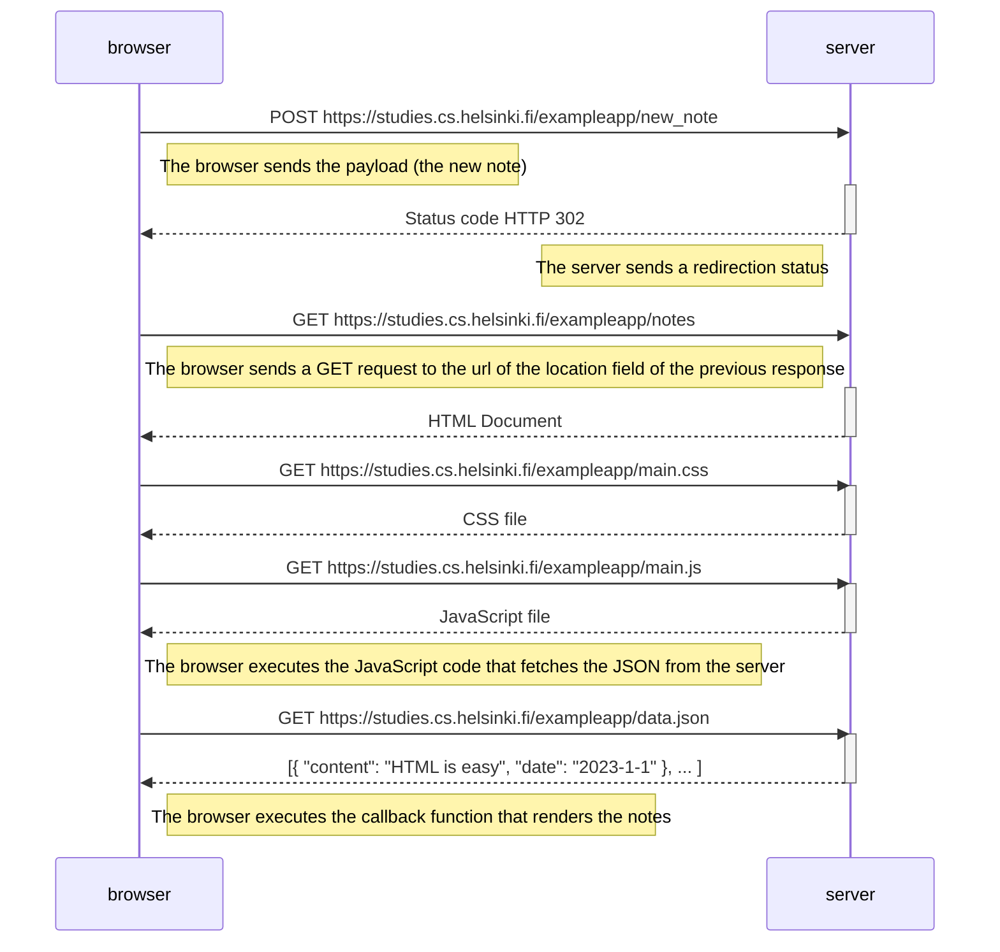

```mermaid
sequenceDiagram
    participant browser
    participant server

    browser->>server: POST https://studies.cs.helsinki.fi/exampleapp/new_note
    Note right of browser: The browser sends the payload (the new note)
    activate server
    server-->>browser: Status code HTTP 302
    deactivate server
    Note left of server: The server sends a redirection status

    browser->>server: GET https://studies.cs.helsinki.fi/exampleapp/notes
    Note right of browser: The browser sends a GET request to the url of the location field of the previous response
    activate server
    server-->>browser: HTML Document 
    deactivate server

    browser->>server: GET https://studies.cs.helsinki.fi/exampleapp/main.css
    activate server
    server-->>browser: CSS file
    deactivate server

    browser->>server: GET https://studies.cs.helsinki.fi/exampleapp/main.js
    activate server
    server-->>browser: JavaScript file
    deactivate server

    Note right of browser: The browser executes the JavaScript code that fetches the JSON from the server

    browser->>server: GET https://studies.cs.helsinki.fi/exampleapp/data.json
    activate server
    server-->>browser: [{ "content": "HTML is easy", "date": "2023-1-1" }, ... ]
    deactivate server

    Note right of browser: The browser executes the callback function that renders the notes
```