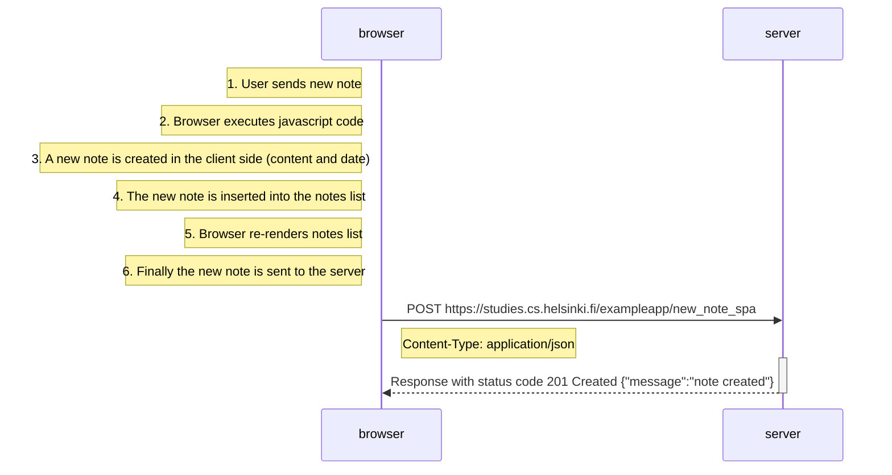

```mermaid
sequenceDiagram
    participant browser
    participant server

    Note left of browser: 1. User sends new note
    Note left of browser: 2. Browser executes javascript code
    Note left of browser: 3. A new note is created in the client side (content and date)
    Note left of browser: 4. The new note is inserted into the notes list
    Note left of browser: 5. Browser re-renders notes list
    Note left of browser: 6. Finally the new note is sent to the server


    browser->>server: POST https://studies.cs.helsinki.fi/exampleapp/new_note_spa
    Note right of browser: Content-Type: application/json
    activate server
    server-->>browser: Response with status code 201 Created {"message":"note created"}
    deactivate server
```